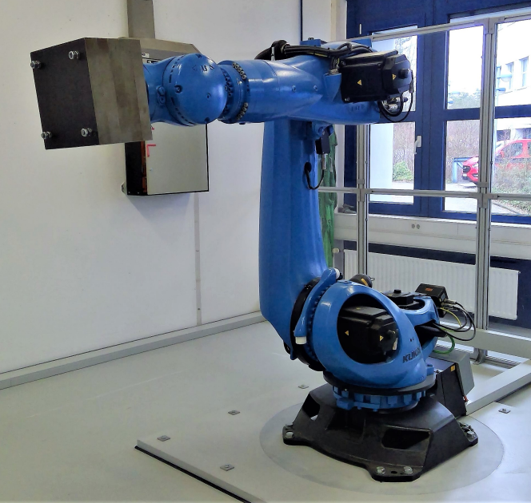

# 🦾🔵 Roblue

## Learning-based augmentation of physics-based models: an industrial robot use case

In this repository you find an implementation of a system identification method for combined physics-based and neural network models. We use an [input/output dataset recorded from a KUKA KR300 R2500 Ultra robot](https://www.nonlinearbenchmark.org/benchmarks/industrial-robot). You can also find the physics-based model of this robot here. Furthermore, this repository allows you to reproduce the results in our [paper](#paper).



## Requirements

- A machine with Ubuntu: we have tested it with version 20.04.6 LTS.
- Many CPU cores preferred, for the hyperparameter tuning. No GPU needed. At least 32 GB RAM.
- An Anaconda environment: we have tested it with `conda 23.3.1`.
- `tmux`, the terminal multiplexer from the Ubuntu repositories: `sudo apt install tmux`, we tested it with version 3.0a. (In the hyperparameter tuning, each of the processes will run in parallel, in a separate `tmux` tab.)
- PyTorch: we have tested it with `1.11.0+cu113`. The command to install it into the Anaconda environment: 
- Other PIP packages: `pip install plotly kaleido matplotlib numpy tqdm scipy`

```
pip install torch==1.11.0+cu113 --extra-index-url https://download.pytorch.org/whl/cu113
```
Test that it works:
```
$ python3
>>> import torch
>>> torch.__version__
'1.11.0+cu113'
```

- [DeepSI](https://github.com/GerbenBeintema/deepSI). Use this version:
```
git clone git@github.com:ha7ilm/deepSI.git
cd deepSI
git checkout andras-dev-notrace
pip install -e .
```
Test that it works:
```
$ python3
>>> import deepSI
>>> deepSI.System
<class 'deepSI.systems.system.System'>
```

## Quick start

The default parameters in the script are specified as:

    emulate_exp_dir = 'exp_rc1_0.0_100'
    paper_case = 3

This means model 4. ("rc1") with a neural network size 100, weight decay set to 0.0, and case 3.

1. Clone this repository and type `cd roblue/roblue` to navigate into the source directory. 
2. You can run this model by typing `./startroblue.sh`

## Reproduce results from paper

1. Clone this repository three times:

    git clone https://github.com/ha7ilm/roblue roblue_case_1
    git clone https://github.com/ha7ilm/roblue roblue_case_2
    git clone https://github.com/ha7ilm/roblue roblue_case_3

2. Edit `roblue/roblue.py` accordingly (for the three different `paper_case = █`).
3. Choose the case to run. Navigate to `cd roblue_case_█/roblue`.
2. `python3 createexpdirs.py` to create the directories for the experiment in the repo root. 
3. `bash createtmuxwindows.sh` to start all the processes in separate windows. You can navigate between the windows with <kbd>Ctrl</kbd>+<kbd>n</kbd> and <kbd>Ctrl</kbd>+<kbd>p</kbd>.
4. Inspect with `top` or `htop` when does the program finish. 
5. Once the processing has finished, run `python3 concatcsv.py` from within `roblue/roblue`. 
6. Inspect the output in Google Sheet or Excel. It's available under `all_exp_results.csv`.
7. Go back to step 3. and move forward to the next case.

## Output tables and figures

To generate the table: from `all_exp_results.csv`, columns `bestmodel_test_150_step_nrms` for comparison of models across cases 1., 2., and 3. For each of the models, pick the lowest error in this column.

To generate the bar graph of the results, columns `bestmodel_training_150_step_nrms`, `bestmodel_validation_150_step_nrms`, `bestmodel_test_150_step_nrms` from `all_exp_results.csv`.

The short simulations model 0.a. figure: `your_case_3_dir/exp_rc1_0.0_100/initial_without_nn_test_150_short_sims.svg`.

The short simulations case 3., model 4. figure: `your_case_3_dir/exp_rc1_0.0_100\after_fit_bestmodel_with_nn_test_150_short_sims.svg`.

The 150-step-NRMS per simulation case 3., model 4. figure: `your_case_3_dir/exp_rc1_0.0_100\after_fit_bestmodel_with_nn_test_150_nsn_per_sim.svg`.

The 150-step-NRMS per simulation case 3., model 0.b. figure: `your_case_3_dir/exp_r01_1.0_1000\after_fit_bestmodel_with_nn_test_150_short_sims.svg`.

(This is supposing that you cloned the repo into `your_case_3_dir`, `your_case_2_dir` and `your_case_1_dir` to reproduce all three cases.)

## Paper <a name="paper"></a>

You can cite our paper as:
```
András Retzler, Roland Tóth, Maarten Schoukens, Gerben Beintema, Jonas Weigand, Jean-Philippe Noël, Zsolt Kollár and Jan Swevers, "Learning-based augmentation of physics-based models: an industrial robot use case", TODO, 2023, vol. TODO, p. TODO
```

## Notes

The code is available under GPLv3 license, see `LICENSE`.

OpenAI models GPT-3.5-turbo, GPT-4, Codex were used to improve the code in this repository. 